# Excel Projects

A collection of Excel projects completed during my Data Analyst bootcamp, covering data cleaning, formulas, pivot tables and visualisations.
All datasets used in these projects were provided during the bootcamp and sourced from Kaggle.

## Contents
- [1. Retail Sales Analysis](#1-retail-sales-analysis)
- [2. Bike Sales & SWITCH Dataset](#2-bike-sales--switch-dataset)
- [3. Bike Sales Visualisations](#3-bike-sales-visualisations)
- [4. Student Records Table](#4-student-records-table)

---

## 1. Retail Sales Analysis

For this task, I was given a retail sales dataset. I turned the raw data into a structured Excel table, then used formulas and pivot tables to calculate commission and summarise sales by customer and product category. 

### Building the table

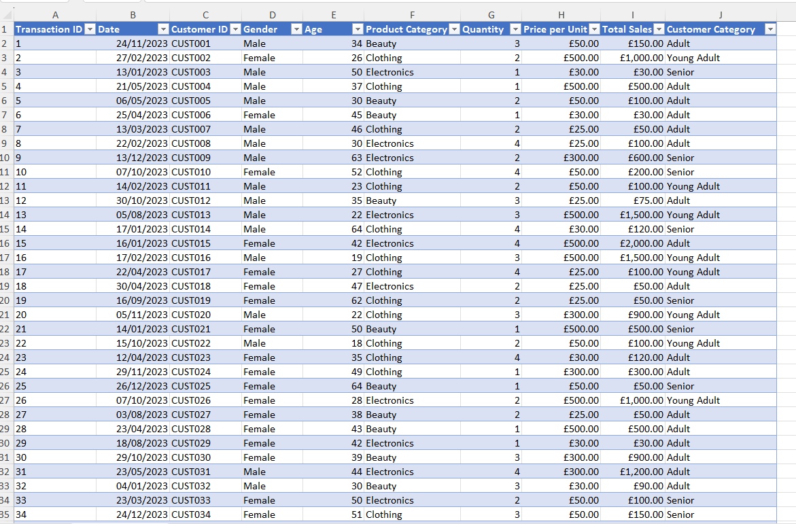

I converted the raw data into an Excel Table using Ctrl+T. The columns included Transaction ID, Date, Customer ID, Gender, Age, Product Category, Quantity and Price per Unit. Converting the data into a table made it easier to sort, filter and reference in formulas, and it also expands automatically if new rows are added.

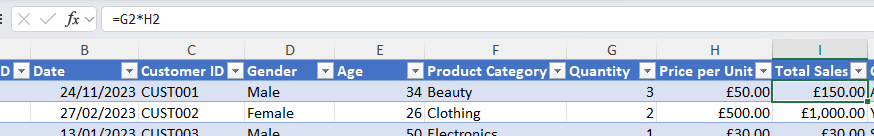

*Total Sales column added*

**Total Sales**: `=G2*H2`, This formula multiplies quantity by unit price to calculate the total value of each sale. 
 
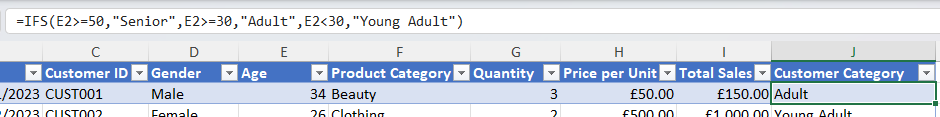

*Customer Category column added*

**Customer Category**:  `=IFS(E2>=50,"Senior",E2>=30,"Adult",E2<30,"Young Adult")`, This formula groups customers into age bands, making it easier to compare sales patterns across different age groups.

### Commission calculations

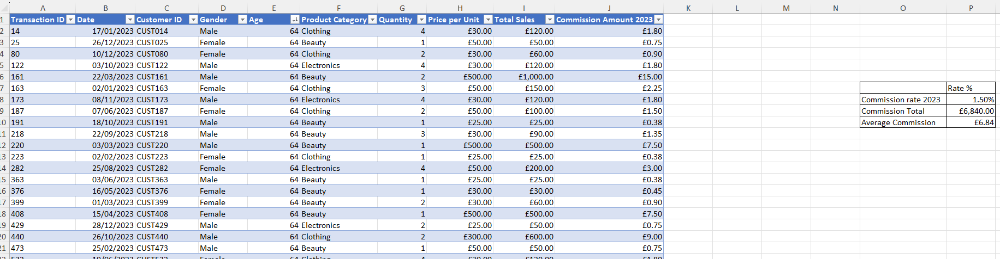

I filtered the data to customers aged 64 and added a commission amount column, along with a summary box for commission rate, total commission and average commission.

**Commission Amount Column**: `=I3*$P$8`, This calculates commission by multiplying total sales by a fixed 1.5% rate. The `$` locks the reference so it stays fixed when copied down each row, rather than shifting to a different cell each time.

**Commission Total**: `=SUM(range)` This shows the total commission earned across the filtered sales.

**Average Commission**:  `=AVERAGE(range)` This shows the average commission per sale and helps compare performance across different sales volumes.

The total gives an overview of commission costs for budgeting, while the average shows what a typical sale earns. This is useful for spotting whether costs are changing due to sales volume or sales value. 

### Pivot tables and slicers

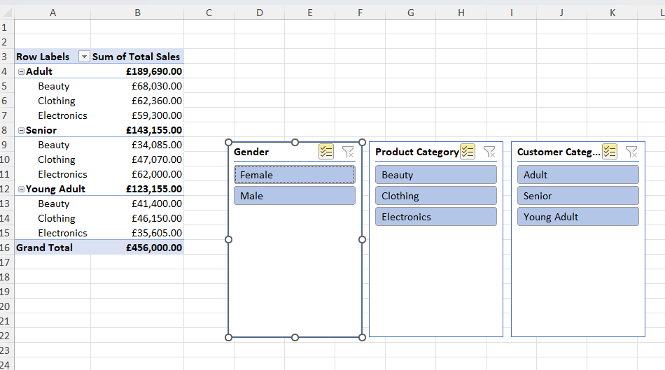

*Total Sales by Customer Category and Product Category, with slicers for Gender, 
Product Category, and Customer Category.*

I built a pivot table to summarise sales by customer category and product category, with slicers for Gender, Product Category and Customer Category. The slicers make it easy to filter the data interactively without rebuilding the table. This is useful to see which groups and product categories are driving the most sales, so marketing or stock decisions can be focused on what's performing well. 
 
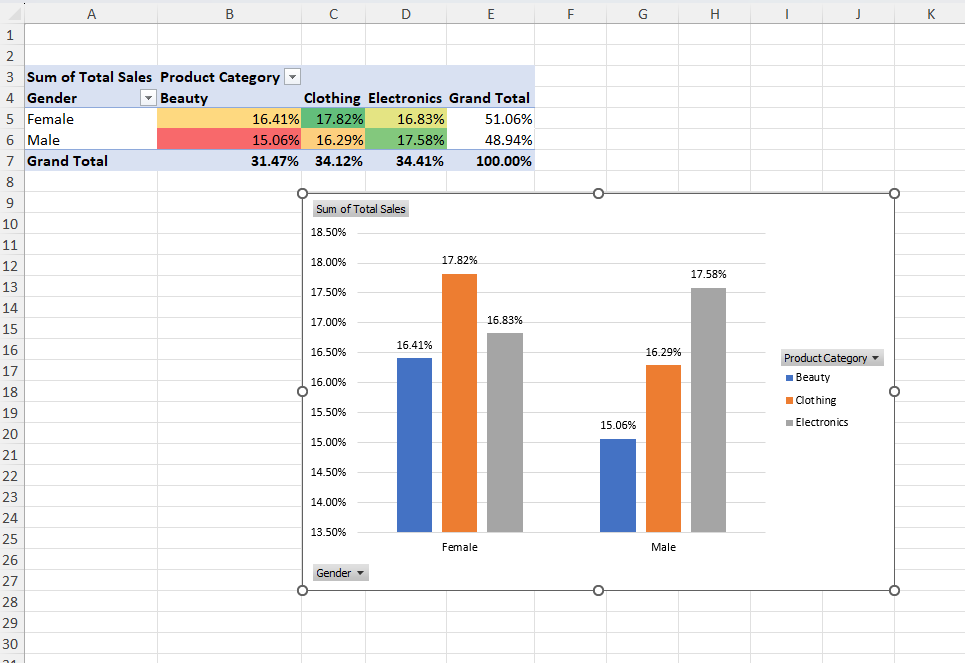

I also created a second pivot table showing sales by Gender and Product Category as a percentage of the grand total. I paired this with a clustered column chart to make the comparison clearer. Showing the data as percentages makes it easier to compare group behaviour fairly.

## 2. Bike Sales & SWITCH Dataset

For these tasks, I analysed the bike sales data by country, age group and gender using a pivot table, and used the `SWITCH` function to categorise sales volume into text labels. 

### Bike Sales Pivot Table 

Before building the pivot table, I cleaned the Country column, as some entries were inconsistently capitalised (e.g. "australia" vs "Australia"). I duplicated the column, used a formula to correct the casing, then pasted the corrected values back over the original.

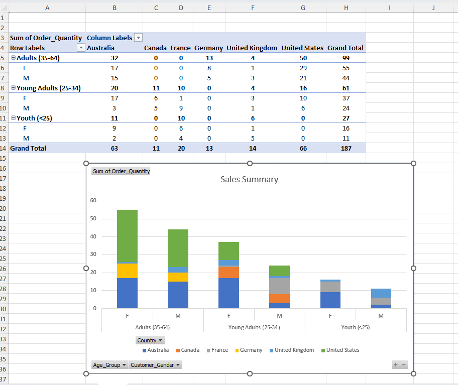

I then created a pivot table and stacked column chart showing the sum of order quantity by Country, Age Group and Customer Gender.

**Findings** 
- The United States is the most profitable market overall by order quantity.
- In the United States, the Adult age group generated the highest sales, and female customers outperformed male customers by 38%. 
- Australia and the United Kingdom  are the only countries with sales across all market categories, with Australia having 350% more customers than the UK.   
- Germany's customers are exclusively Adults, with females making up 61% of that group.  
- Canada is the lowest performing market, with customers only in the Young Adult group, suggesting its marketing or product positioning may need further investigation. 

### SWITCH function task

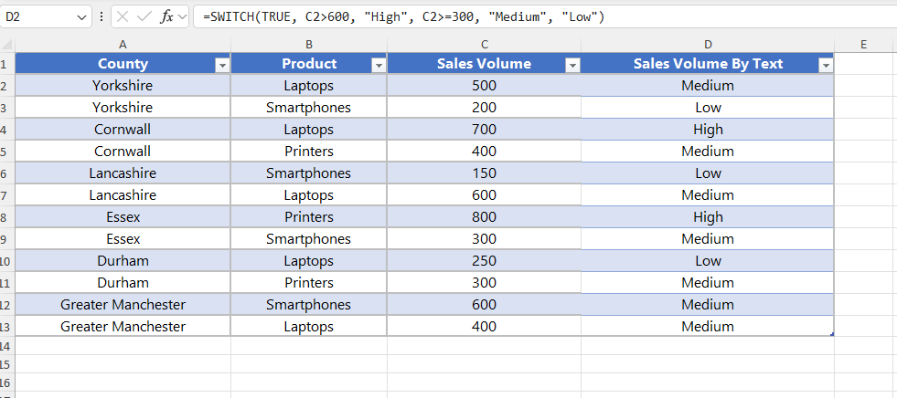

I added a Sales Volume By Text column using: 
`=SWITCH(TRUE, C2>600,"High", C2>=300,"Medium","Low")`
This group's sales volume into High, Medium or Low bands without needing nested IF statements. Using SWITCH(TRUE, ...) makes the formula cleaner and easier to read.

---

## 3. Bike Sales Visualisations

I built three chart types in Excel: a line, a stacked column, and a pie, to visualise bike sales revenue and profit trends over time, by country, and by age group. 

### Revenue vs. Profit by year

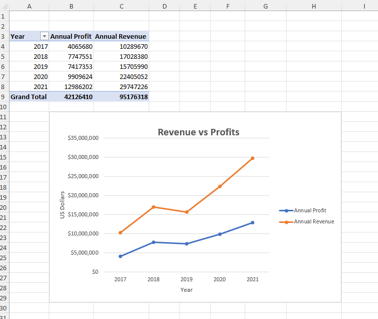

I created a line chart to track how revenue and profit changed from 2017 to 2021. Both trends increased over time, but revenue grew faster than profit, especially from 2019 onwards.

### Product revenue by country

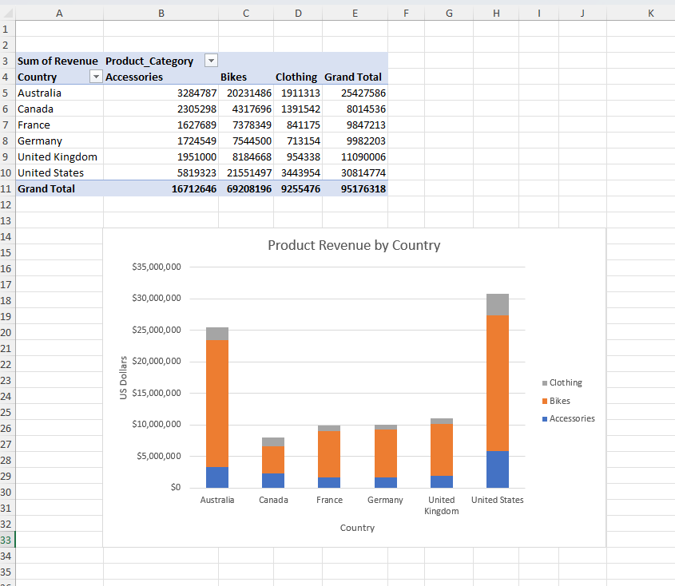

I used a stacked column chart to compare revenue by product category across six countries. Bikes were the dominant product in every country, and the United States generated the highest total revenue, with more than double that of the next-highest country (Australia).

### Revenue by age group

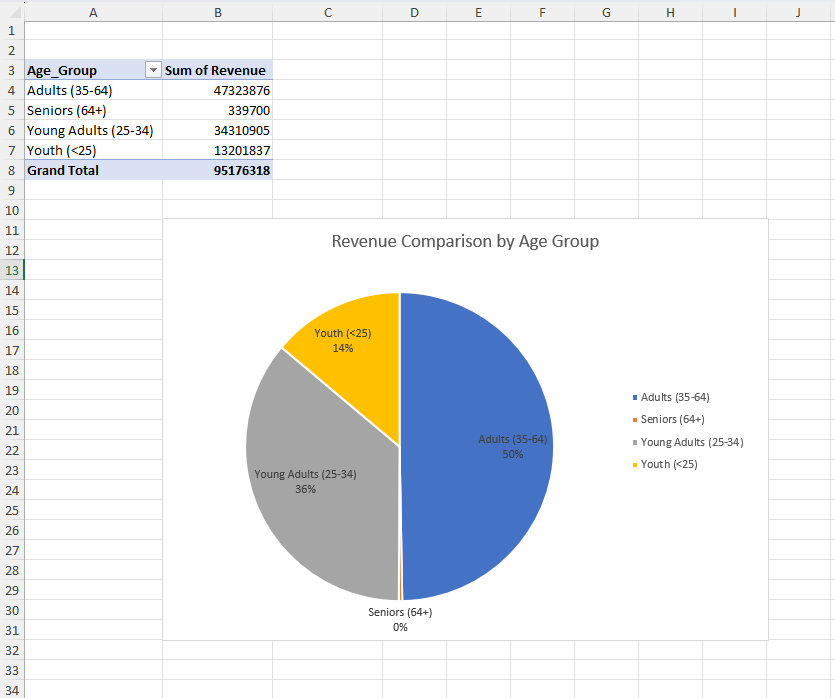

I used a pie chart to show revenue split by age group. Adults (35–64) accounted for half of total revenue, followed by Young Adults (25–34) at 36%, while Seniors made up a very small share.

---

## 4. Student Records Table

For this task, I analysed a small classroom dataset. I calculated averages and the 
highest score, sorted and filtered for top performers, and highlighted the results 
using conditional formatting. As a stretch task, I identified 
additional meaningful insights that could be drawn from the table.

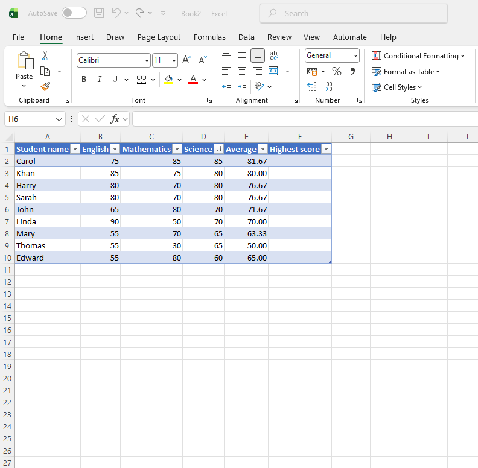

I added an Average column using: 

`=AVERAGE(B2:D2)` 

This calculates each student’s average across English, Mathematics and Science.
 
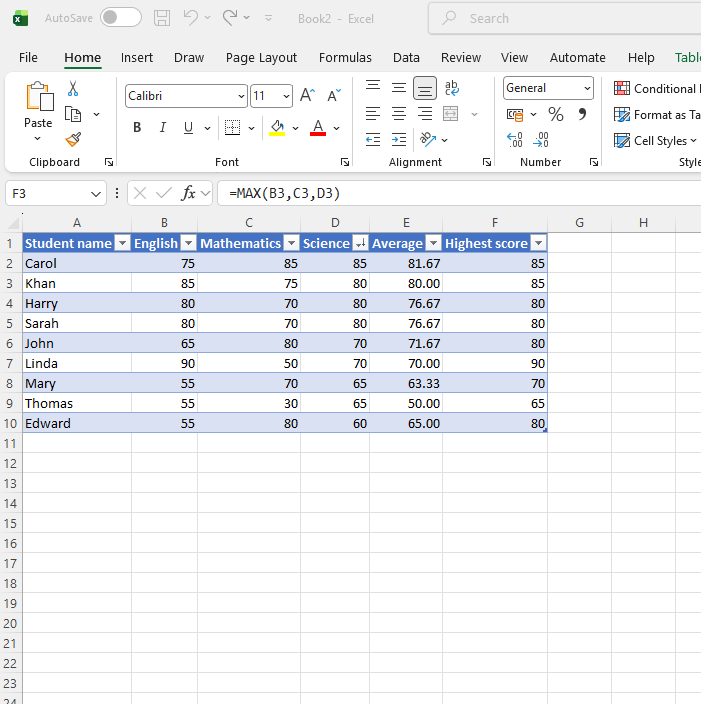

I also added a Highest Score column using: 

`=MAX(B3,C3,D3)` 
This identifies each student’s strongest subject at a glance.
 
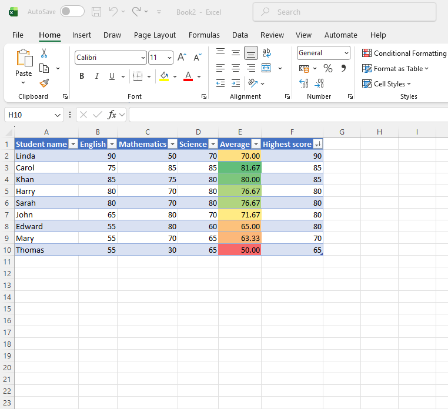

I sorted the table by Highest Score in descending order and applied conditional formatting to the Average column. This made strong and weak performers easy to identify visually.

### Stretch task

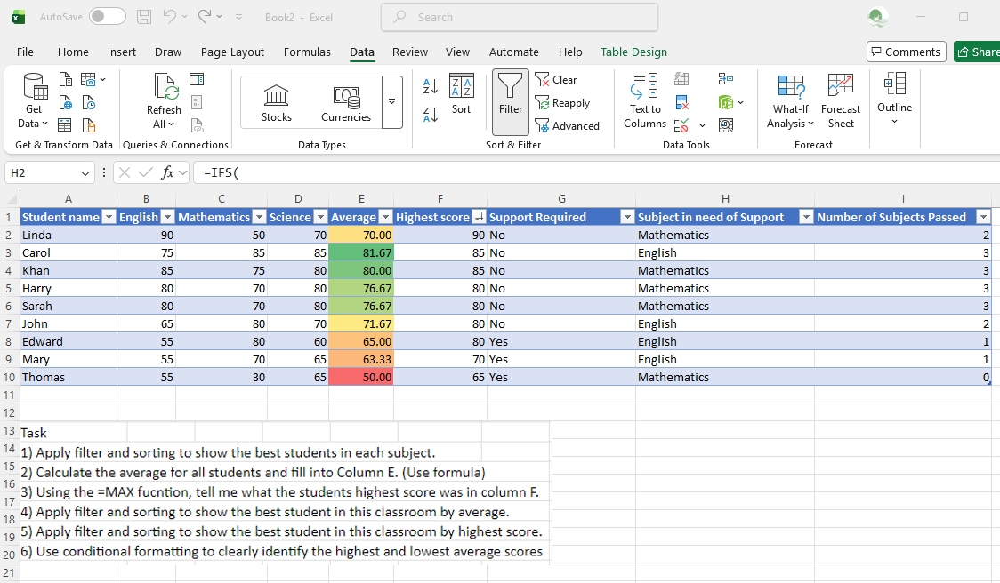

I added three extra columns: Support Required, Subject in Need of Support and Number of Subjects Passed.

**Support Required** 
`=IF(E2<70,"Yes","No")` 
This flags students whose average fell below the pass threshold.
 
**Subject in Need of Support** 
`=IFS(B2=MIN($B2:$D2),"English",C2=MIN($B2:$D2),"Mathematics",D2=MIN($B2:$D2),"Science")` 
This identifies each student’s weakest subject.
 
**Number of Subjects Passed** 
`=COUNTIF(B2:D2,">=70")` 
This counts how many subjects each student scored 70 or above in.
 
These extra columns turn raw scores into something more useful by helping a teacher quickly see who needs support and in which subject.
