# Power BI

A collection of Power BI labs completed during my Data Analyst bootcamp.

## Contents
- [1. Retail Sales Dashboard](#1-retail-sales-dashboard)
- [2. Data Preparation in Power BI Lab](#2-data-preparation-in-power-bi-lab)
- [3. Designing a Power BI Report Lab](#3-designing-a-power-bi-report-lab)
- [4. Visual Calculations in Power BI Lab](#4-visual-calculations-in-power-bi-lab)

---

## 1. Retail Sales Dashboard

For this project, I explored Power Query in Excel to clean and shape a retail sales dataset, then exported it into Power BI to build an interactive dashboard.

🔗 [View live dashboard](https://app.powerbi.com/view?r=eyJrIjoiZDllZjE0YjItOWY0OC00ZmJlLWEyY2ItMmQ1ODk5ZjUwNmVmIiwidCI6IjNlYTdjMTI4LWM2MDEtNDQ3OS1hMDAzLWUxNGQwMGMwYjVjYiJ9)

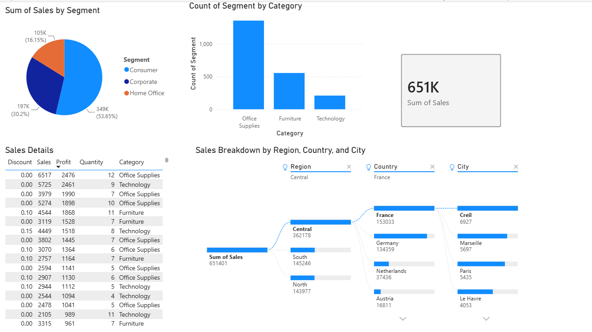

*Note: the decomposition tree (bottom right) doesn't render in the shared/embedded 
version due to a known Power BI limitation with AI-powered visuals. It's fully 
functional in Power BI Desktop, shown in the screenshot above.*

### What I built:

**Sum of Sales by Segment**  
A pie chart showing the proportion of total sales coming from Consumer, Corporate, and 
Home Office segments  

**Count of Segment by Category**  
A bar chart showing how many transactions fall into each product category (Office 
Supplies, Furniture, Technology)  

**Sum of Sales (KPI card)**  
A card visual highlighting the overall sales total (651K) at a glance  

**Sales Details**  
A table showing order-level data: Discount, Sales, Profit, Quantity, and Category,
for anyone wanting to look at individual transactions rather than summaries  

**Sales Breakdown by Region, Country, and City**  
A decomposition tree letting you drill down from total sales through Region → Country 
→ City, with filters for each level  

### Why this is useful:
Bringing all of this together into one dashboard means a business doesn't have to dig through raw spreadsheet rows to understand performance. At a glance, they can see which customer segment and product category drive the most sales, then use the decomposition tree to drill into exactly which region, country, or city is performing well or underperforming, which is much quicker than filtering a spreadsheet manually. The interactivity (filters, drill-down) also means the same dashboard can answer many different questions without needing to rebuild it each time.

## 2. Data Preparation in Power BI Lab

I worked through two connected labs covering how to get, clean, and load data into 
Power BI, importing from multiple sources, fixing data quality issues, and shaping tables ready for reporting. 
 

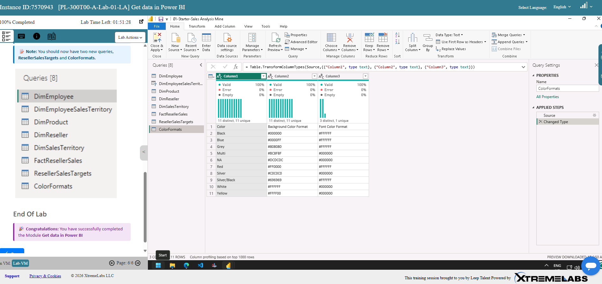

I used Power Query's column profiling tools to check data quality across the imported 
tables. This surfaced a data entry issue; some rows had "Ware House" instead of 
"Warehouse", which needed fixing before the data could be trusted for analysis. 
  
 

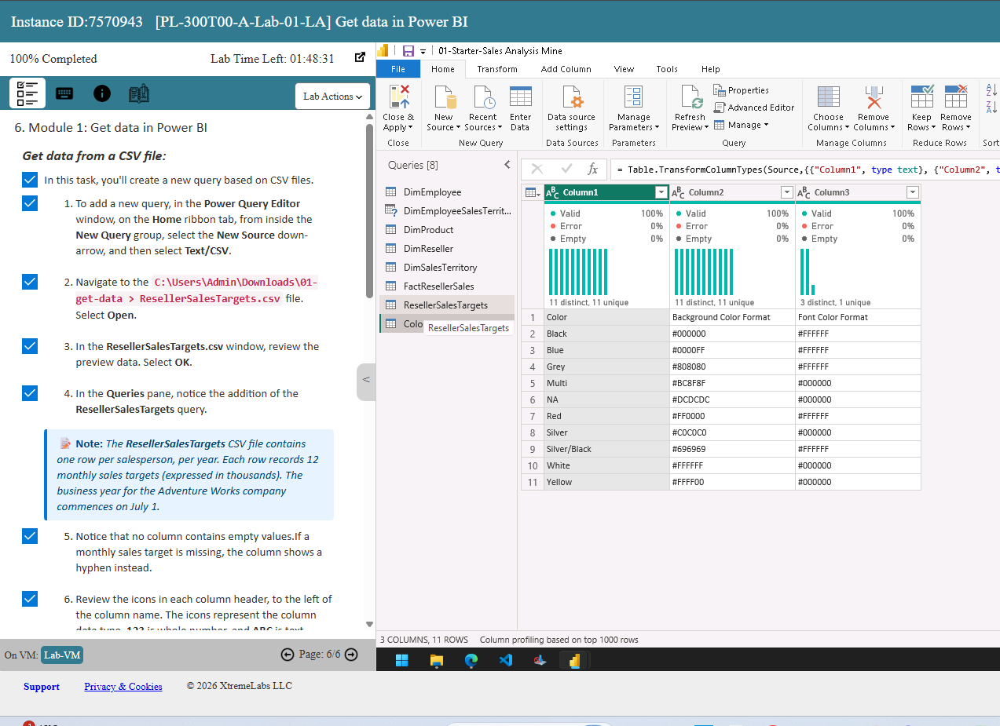

I imported an additional CSV file (Reseller Sales Targets) alongside the data already 
pulled from other sources, bringing the total to 8 queries ready to be shaped and 
loaded into the data model. 
  
 

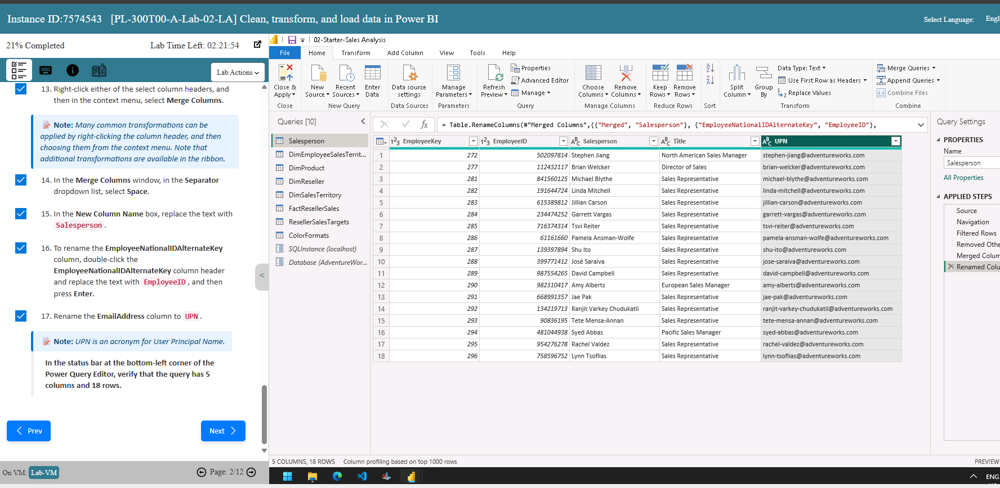

I merged columns (combining first and last name into a single "Salesperson" field) 
and renamed others for clarity, for example, `EmployeeNationalIDAlternateKey` to 
`EmployeeID`, and `EmailAddress` to `UPN` (User Principal Name). 
  
 

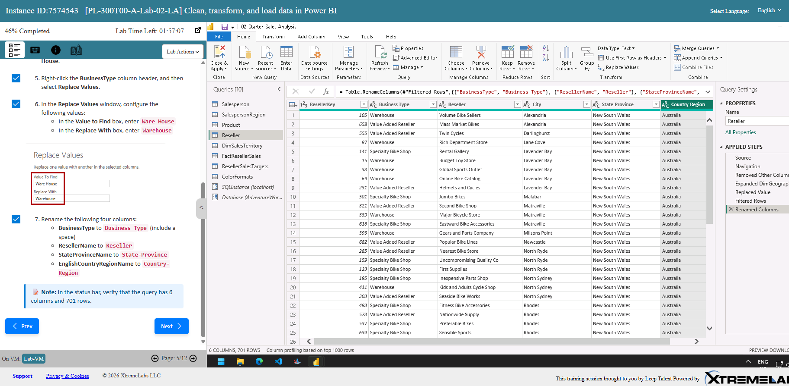

I used Replace Values to fix the "Ware House" data quality issue spotted earlier, 
correcting it to "Warehouse" across the dataset, then renamed several columns 
(Business Type, Reseller, State-Province, Country-Region) for consistency. 
  
 

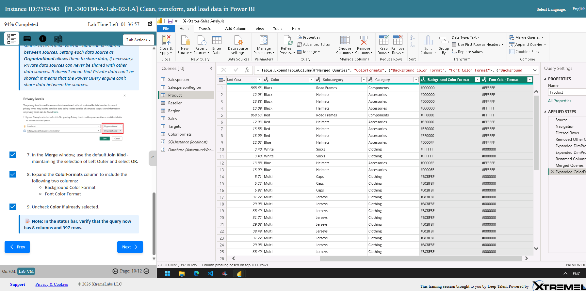

I merged the Product query with a ColorFormats lookup table, then expanded the 
Background Colour Format and Font Colour Format columns into the main table, adding 
extra formatting detail without manually re-entering it. 
  
 

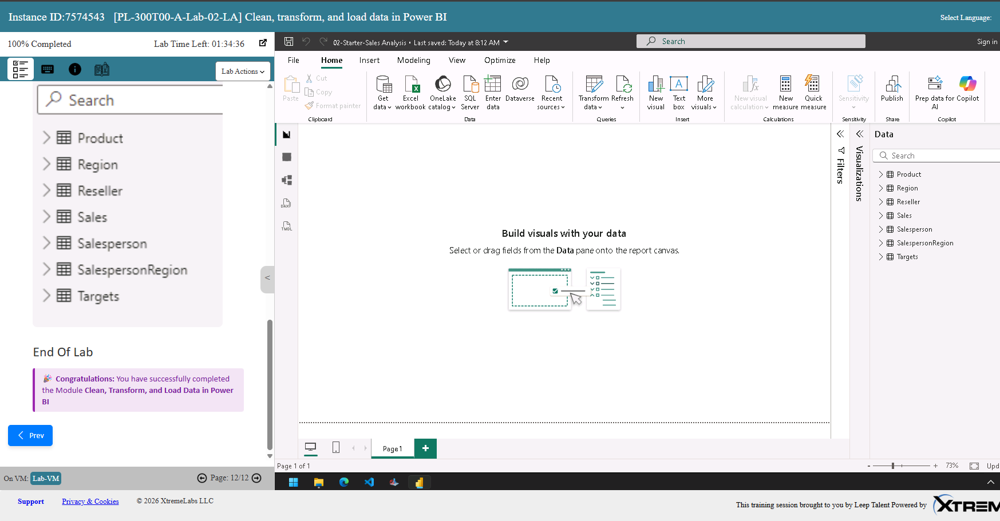

Once all queries were cleaned and shaped, I loaded the final data model into Power BI 
Desktop, ready to build visuals and reports from.

---

## 3. Designing a Power BI Report Lab

I built a multi-page report with slicers, filters, and a combination chart to explore 
sales performance across years, regions, and product categories. 
 

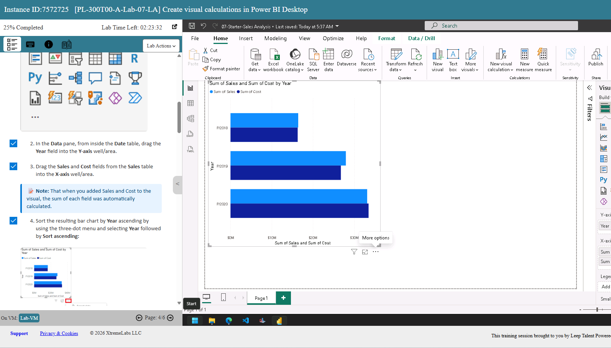

I added a Year slicer and a Region slicer (using the Region hierarchy field) to let anyone viewing the report filter the whole page by year or region interactively. 
  
 

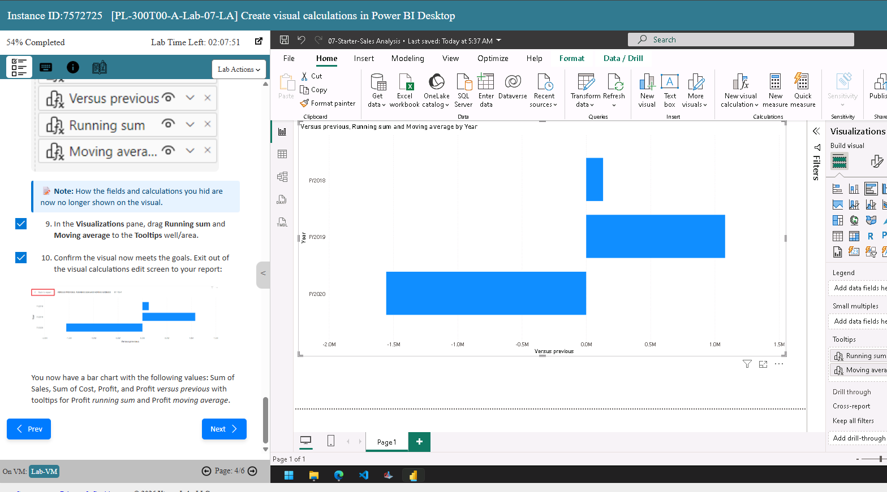

I built a combination chart, columns for Sum of Sales, with a line overlay for 
Profit Margin, broken down by month, alongside supporting charts for Sales by 
Country and Category, and Quantity by Category. I turned on data labels so exact 
values are visible without hovering. 
  
 

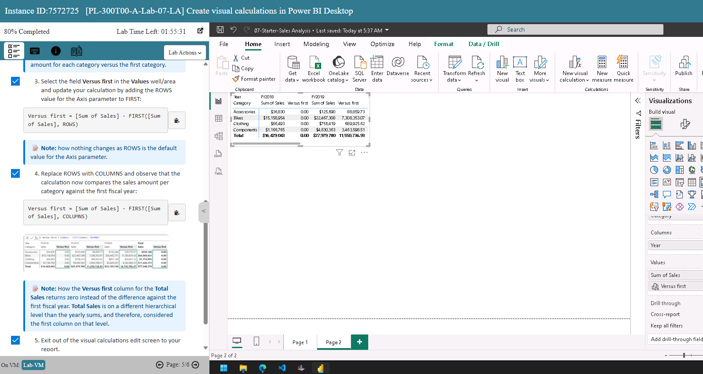

I added page-level filters for Category, Subcategory, Product, and Colour, giving viewers control over which products' sales they want to focus on.

---

## 4. Visual Calculations in Power BI Lab

I used Power BI's visual calculations feature to add running totals, moving 
averages, and period-over-period comparisons directly onto a chart. 
 

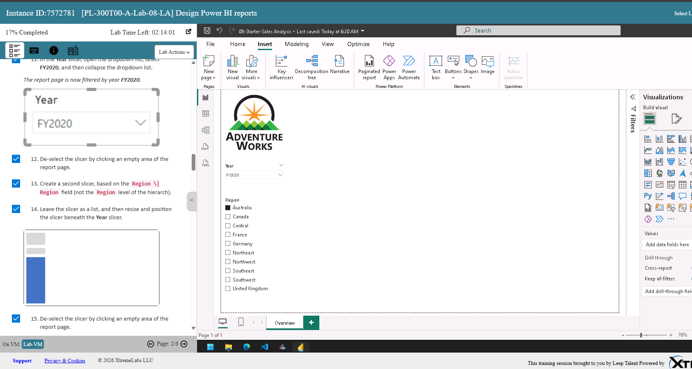

I started with a simple bar chart comparing Sum of Sales and Sum of Cost by year, 
sorted ascending, as the base for the calculations that follow. 
  
 

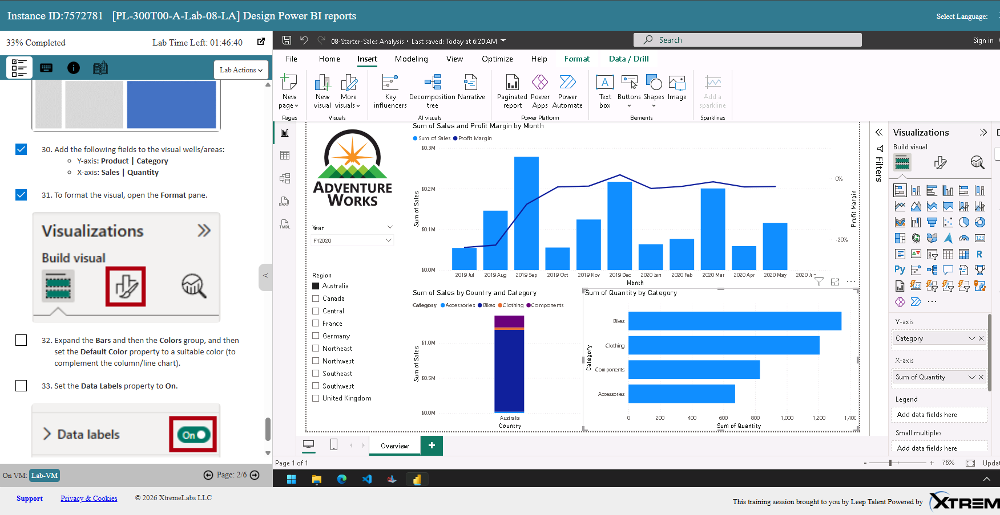

I added Profit, Profit versus previous period, Running sum, and Moving average as 
visual calculations, setting the latter two to display as tooltips, so the chart 
stays clean while still showing the extra detail on hover. 
  
 

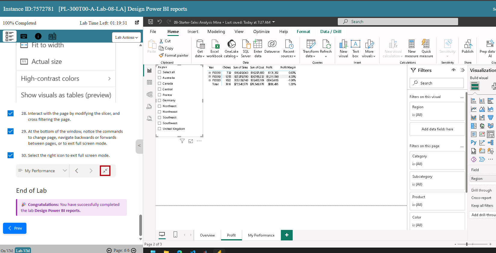

I updated the Running sum calculation using the `HIGHESTPARENT` reset parameter, so the running total restarts at the beginning of each new fiscal year rather than 
accumulating indefinitely, which is useful for year-on-year comparisons rather than an 
all-time total. 
 

---

## Skills Demonstrated

- Importing and merging data from multiple sources (CSV, database tables)
- Cleaning and transforming data using Power Query (Replace Values, renaming, merging columns)
- Building relationships between tables in the data model
- Creating pie, bar, and combination charts
- Using slicers and filters (page-level and visual-level) for interactive reports
- Building KPI cards and decomposition trees
- Creating visual calculations (running sum, moving average, period-over-period comparisons)
- Publishing and sharing interactive dashboards

 
