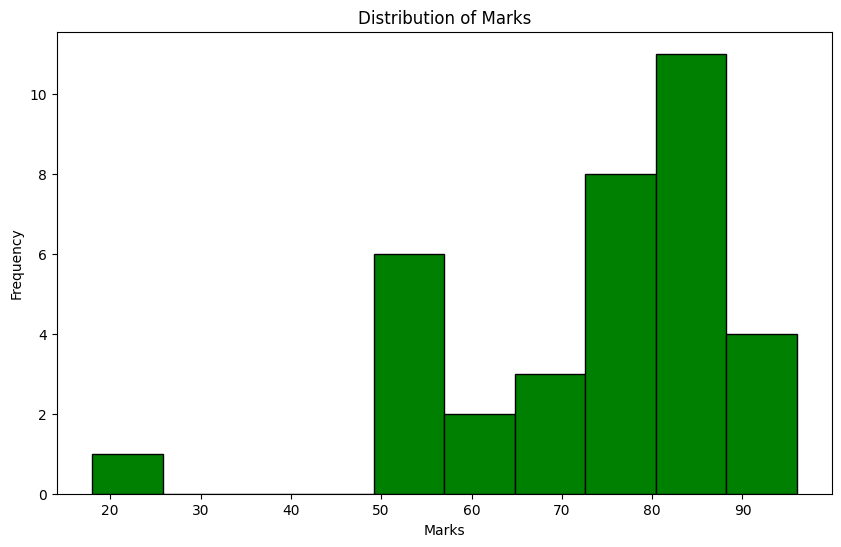
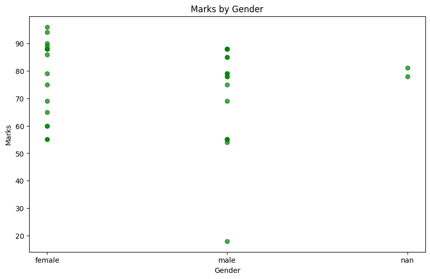
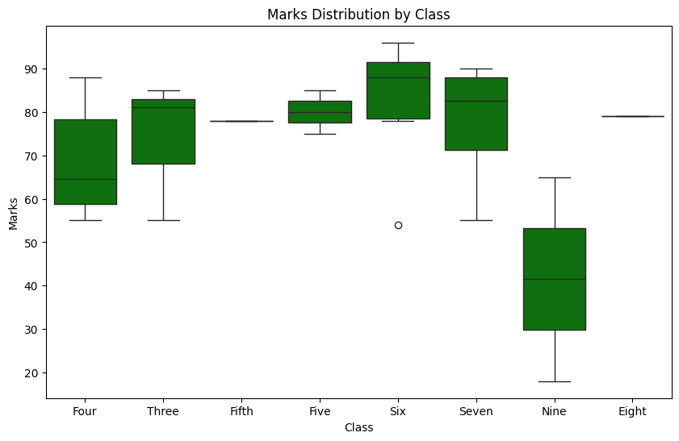
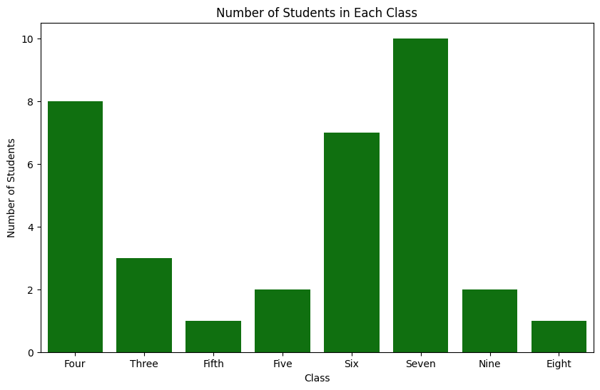
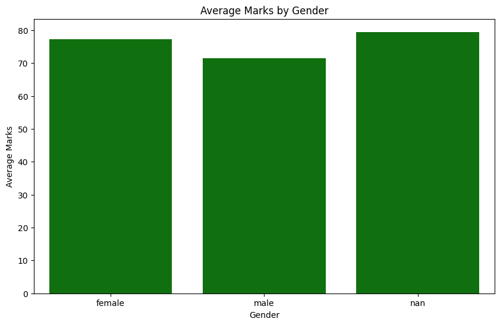

# Python Projects

A collection of Python projects completed during my Data Analyst bootcamp, using 
Pandas in Google Colab.

## Contents
- [1. Student Data Analysis with Pandas](#1-student-data-analysis-with-pandas)
- [2. Student Data Visualisations](#2-studen-data-visualisations)

---

## 1. Student Data Analysis with Pandas

A group exercise using the `student.csv` dataset, covering the core Pandas workflow 
from loading data through to exporting results, indexing, filtering, aggregation, 
pivot tables, and visualisation.

📄 [View the full notebook](python_coding.ipynb)
<br>
### Loading and exploring the data

```python
import pandas as pd
df = pd.read_csv('student.csv')
```

I made sure Pandas was imported first, then loaded the student CSV into a DataFrame. <br>
<br>

```python
df.head()
```

This shows the first 5 rows of the DataFrame, including the column names. <br>
<br>

```python
df.info()
```

This shows information about the DataFrame, including the index, data types, and columns. <br>
<br>

```python
df.describe()
```

This shows summary statistics for the numeric columns, in this case, `id` and `mark`. <br>
<br>

### Indexing and slicing

```python
df['name']
```

Selects a single column from the DataFrame. <br>
<br>

```python
df[['name', 'mark']]
```

To select more than one column, the column names go inside double square brackets. <br>
<br>

```python
df.iloc[0:3]
```

Used `iloc` to select rows by their index position, since indexing starts at 0, this selects the first 3 rows. <br>
<br>

```python
df[df['class'] == 'Four']
```

Filters the DataFrame to only show rows where `class` is equal to "Four". <br>
<br>

### Data manipulation

```python
df['passed'] = df['mark'] >= 60
```

Adds a new column, `passed`, which shows `True` or `False` depending on whether each student's mark is 60 or above. <br>
<br>

```python
df.rename(columns={'mark': 'score'}, inplace=True)
df.head()
```

Renamed the `mark` column to `score`, then checked `df.head()` to confirm the change 
took effect. <br>
<br>

```python
df.drop('passed', axis=1, inplace=True)
```

Dropped the `passed` column. `axis=1` tells Pandas to remove a column rather than a row, and `inplace=True` makes the change to the original DataFrame rather than just 
returning a preview. <br>
<br>

### Aggregation and grouping

```python
df.groupby('class')['score'].mean()
```

Groups the DataFrame by `class`, then calculates the mean `score` for each group. <br>
<br>

```python
df.groupby('class').size()
```

Groups by `class` again, but this time counts how many students are in each one. <br>
<br>

```python
df.groupby('gender')['score'].mean()
```

Groups by `gender` and finds the average score for each group. <br>
<br>

### Advanced operations

```python
pd.pivot_table(df, index='class', columns='gender', values='score')
```

Builds a pivot table where each row is a class, each column is a gender, and each cell 
shows the average score for that group. <br>
<br>

```python
def get_grade(score):
    if score >= 85:
        return 'A'
    elif score >= 70:
        return 'B'
    elif score >= 60:
        return 'C'
    else:
        return 'D'

df['grade'] = df['score'].apply(get_grade)
```

Created a new `grade` column by applying a function that assigns a letter grade based on the score. <br>
<br>

```python
df.sort_values(by='score', ascending=False)
```

Sorts the DataFrame by `score`, with the highest scores at the top. <br>
<br>

### Exporting data

```python
df.to_csv('students_with_grades.csv', index=False)
```

Saved the updated DataFrame to a new CSV file, excluding the row index. <br>
<br>

### Visualisation

```python
df.groupby('class')['score'].mean().plot(kind='bar')
plt.show()
```

A bar chart showing the average score for each class, making it easy to see at a glance which class scored higher or lower. <br>
<br>

---

## 2. Student Data Visualisations

Using the same `student.csv` dataset, I created a series of charts with Matplotlib and 
Seaborn to visualise mark distributions, class sizes, and performance by gender.

📄 [View the full notebook](Day4Task2.ipynb)
<br>


```python
plt.hist(df['mark'], bins=10, edgecolor='black', color='green')
plt.title('Distribution of Marks')
plt.xlabel('Marks')
plt.ylabel('Frequency')
plt.show()
```

A histogram showing how student marks are distributed across the class, making it 
easy to see where most students' scores cluster.<br>
<br>



```python
df['gender'] = df['gender'].astype(str)
plt.scatter(df['gender'], df['mark'], alpha=0.7, color='green')
plt.title('Marks by Gender')
plt.xlabel('Gender')
plt.ylabel('Marks')
plt.show()
```

A scatter plot comparing individual marks by gender, showing the spread of scores 
within each group rather than just an average. <br>
<br>



```python
sns.boxplot(x='class', y='mark', data=df, color='green')
plt.title('Marks Distribution by Class')
plt.xlabel('Class')
plt.ylabel('Marks')
plt.show()
```

A box plot comparing the spread of marks across classes, showing the median, 
quartiles, and any outliers for each class. <br>
<br>



```python
sns.countplot(x='class', data=df, color='green')
plt.title('Number of Students in Each Class')
plt.xlabel('Class')
plt.ylabel('Number of Students')
plt.show()
```

A count plot showing how many students are in each class, useful context for 
interpreting the other charts (for example, a class with very few students may show more 
extreme averages). <br>
<br>



```python
avg_marks_gender = df.groupby('gender')['mark'].mean().reset_index()
sns.barplot(x='gender', y='mark', data=avg_marks_gender, color='green')
plt.title('Average Marks by Gender')
plt.xlabel('Gender')
plt.ylabel('Average Marks')
plt.show()
```

A bar chart comparing the average mark by gender giving a clear, simplified summary 
after seeing the fuller spread in the scatter plot above. <br>
<br>

---

## Skills Demonstrated

- Loading and exploring data with `read_csv`, `head`, `info`, and `describe`
- Indexing and slicing with column selection, `iloc`, and boolean filtering
- Adding, renaming, and dropping columns
- Grouping and aggregating data with `groupby`
- Building pivot tables
- Writing custom functions and applying them with `apply`
- Sorting data
- Exporting DataFrames to CSV
- Data visualisation with Matplotlib and Seaborn (histograms, scatter plots, box 
plots, count plots, bar charts)
