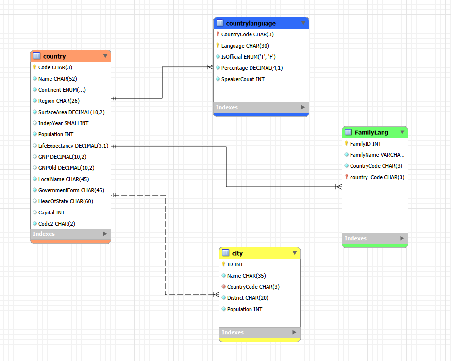

# SQL Projects

A collection of SQL projects completed during my Data Analyst bootcamp, using MySQL Workbench.

## Contents
- [1. Retail Database Design](#1-retail-database-design)

---

## 1. Retail Database Design

This was a group task where we designed a database system for a small retail business (a corner 
shop with groceries, domestic products, and a loyalty scheme), covering everything from 
understanding requirements through to implementation and maintenance.

### Understanding the requirements

As part of the group, I helped identify the core data the business would need to store: products (with stock 
levels), customers, suppliers, sales transactions, and loyalty scheme details. I also 
considered who would use the database day to day, cashiers processing sales, and 
updating loyalty points, stock controllers monitoring stock levels, and managers 
reviewing sales reports and customer trends.

### Designing the schema

I structured the database using a snowflake schema, with **Sales** as the fact table 
and **Products**, **Customers**, and **Suppliers** as dimension tables. Products link 
to Suppliers via `SupplierID`, and Sales links to both Customers and Products via 
their respective IDs. Primary keys (`ProductSKU`, `CustomerID`, `SupplierID`, 
`TransactionID`) keeps each record unique and helps avoid duplicate data.

### Creating the tables

With the group, I helped write `CREATE TABLE` statements for each table, defining the columns and primary keys:

```sql
CREATE TABLE Suppliers (
    SupplierID INT PRIMARY KEY,
    SupplierName VARCHAR(100),
    ContactDetails VARCHAR(150)
);

CREATE TABLE Products (
    SKU INT PRIMARY KEY,
    ProductName VARCHAR(100),
    Category VARCHAR(50),
    Price DECIMAL(5,2),
    StockCount INT,
    SupplierID INT
);

CREATE TABLE Customers (
    CustomerID INT PRIMARY KEY,
    Name VARCHAR(100),
    Address VARCHAR(150),
    ContactNumber VARCHAR(20),
    Email VARCHAR(100),
    MembershipStatus VARCHAR(20),
    PointsTotal INT
);

CREATE TABLE Sales (
    TransactionID INT PRIMARY KEY,
    TransactionDate DATE,
    Quantity INT,
    CustomerID INT,
    SupplierID INT
);
```

### Populating the database

I used `INSERT INTO` statements to add initial data to each table:

```sql
INSERT INTO Suppliers
VALUES (1, 'Fresh Foods Ltd', '07777777777766');

INSERT INTO Products
VALUES (101, 'Milk', 'Dairy', 1.25, 50, 1);

INSERT INTO Customers
VALUES (1001, 'John Doe', 'jdoe@gmail.com', 'Gold', 250);
```

### Maintaining the database

To keep the data accurate, I considered adding validation rules to prevent invalid 
entries (like negative stock counts or badly formatted emails), along with regular 
stock checks to make sure the database matches what's actually on the shelves. For 
security, I proposed individual staff logins with permission levels, managers with 
broader access to edit records and run reports, general staff with more limited access. 
Since this is a small, local shop, the database doesn't need to run over a WAN and can 
operate on the shop's local network, with daily backups saved to an external drive or 
secure cloud storage.

### Reflection

If the shop wanted to expand its loyalty scheme, a separate Loyalty Rewards table 
could be added to track vouchers, reward levels, and special offers linked to each 
membership number, keeping the core schema simple while still allowing room to grow.

---

## 2. World Database Queries

A set of SQL queries written against a sample `world` database (containing city, 
country, and language data), covering filtering, sorting, aggregation, and joins to 
answer real-world style questions.
<br>



*ERD showing the relationships between the `country`, `city`, and `countrylanguage` 
tables, connected via `CountryCode`/`Code` fields.*
<br>

📄 [View the full list of queries](../projects/sql_queries.txt)

### Filtering and sorting

```sql
-- Country with the highest life expectancy
SELECT 
    Name AS 'Country Name', 
    LifeExpectancy
FROM
    country
ORDER BY 
    LifeExpectancy DESC
LIMIT 1;
```

Used `ORDER BY` combined with `LIMIT 1` to pull out a single top result, rather than 
sorting the whole table and scanning manually.

```sql
-- Cities with population between 500,000 and 1,000,000
SELECT * FROM city WHERE Population BETWEEN 500000 AND 1000000;
```

`BETWEEN` made it possible to filter a numeric range in one clean condition, instead of 
combining two separate `>` and `<` statements.

```sql
-- Cities containing the word "New"
SELECT * 
FROM city
WHERE Name LIKE '%New%';
```

Used `LIKE` with `%` wildcards to match partial text, `%New%` finds "New" anywhere in 
the name, not just at the start or end.

### Aggregation

```sql
-- Number of cities sharing the same name, sorted alphabetically
SELECT
    Name, 
    COUNT(1)
FROM
    city
GROUP BY Name
ORDER BY Name ASC;
```

`GROUP BY` combined with `COUNT(1)` shows how many times each city name repeats across the dataset, useful for spotting common names.

```sql
-- Most populated city
SELECT * FROM city ORDER BY Population DESC LIMIT 1;
```

### Joins

```sql
-- All cities in Spain
SELECT * 
FROM country
INNER JOIN city ON city.CountryCode = country.Code
WHERE country.Name = "Spain";
```

Used an `INNER JOIN` to combine the `country` and `city` tables through their shared 
`CountryCode`/`Code` fields, since population and city data live in separate tables 
but often need to be viewed together.

### Subqueries

```sql
-- Cities with an above-average population
SELECT * 
FROM city
WHERE Population > (SELECT AVG(Population) FROM city);
```

Rather than hardcoding the average population as a number, I used a subquery so the comparison stays accurate even if the underlying data changes.

---

## Skills Demonstrated

- Designing a relational database schema (fact/dimension tables, primary and foreign keys)
- Writing `CREATE TABLE` statements to define tables and their columns
- Inserting data using `INSERT INTO`
- Filtering with `WHERE`, `LIKE`, `BETWEEN`, and `IN`
- Sorting and limiting results with `ORDER BY` and `LIMIT`
- Aggregate functions: `COUNT`, `AVG`, `MAX`
- Grouping data with `GROUP BY`
- Joining tables with `INNER JOIN`, `LEFT JOIN`, and `RIGHT JOIN`
- Writing subqueries instead of hardcoding values
- Planning for database maintenance, security, and backups

<br>
