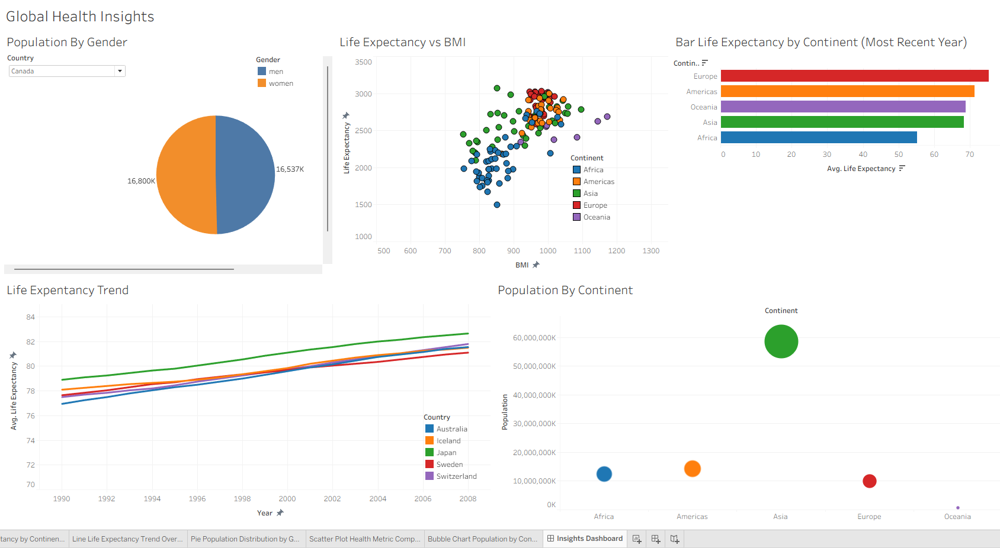
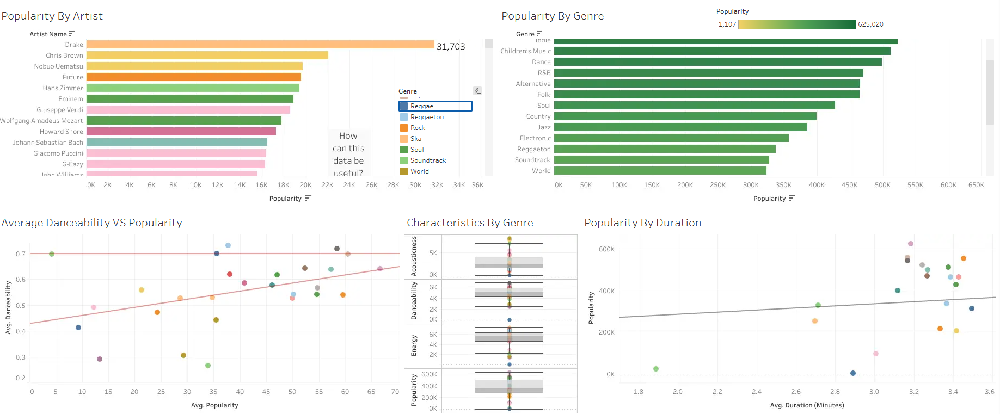

# Tableau Projects

A collection of Tableau dashboards completed during my Data Analyst bootcamp.

## Contents
- [1. Global Health Insights Dashboard](#1-global-health-insights-dashboard)
- [2. Spotify Insights Dashboard](#2-spotify-insights-dashboard)

---

## 1. Global Health Insights Dashboard

**Scenario:**  
Acting as a data analyst for a global health organisation, I used the Gapminder Health dataset to explore life expectancy, population, and BMI trends across countries and continents.

🔗 [View live dashboard on Tableau Public](https://public.tableau.com/views/GlobalHealthInsights_17803278947920/InsightsDashboard?:language=en-GB&publish=yes&:sid=&:redirect=auth&:display_count=n&:origin=viz_share_link)

 
*Some legends (e.g. Continent, Country) scroll to show additional items in the live dashboard.*

### What I built: 
**Life Expectancy by Continent** 
A bar chart showing average life expectancy, sorted 
descending, coloured by continent  
 
**Life Expectancy Trend Over Time** 
A line chart tracking the top 5 countries by average life expectancy from 1983–2008, coloured by country  
 
**Population Distribution by Gender** 
A pie chart showing Canada's population split by gender for 2008, with population labels  
 
**Life Expectancy vs BMI**  
A scatter plot exploring the relationship between average life expectancy and average BMI, with points coloured by continent

### What I found:
- Life expectancy varies strongly by continent, with Europe and Oceania the highest and Africa the lowest. 
- The population is heavily concentrated in Asia. 
- Canada's gender split is almost perfectly balanced. 
- The relationship between BMI and life expectancy doesn't show a simple trend, suggesting other health factors are likely influencing the pattern.

### Reflection:
Health organisations like the NHS could use this kind of data to benchmark UK health outcomes against global trends and spot areas needing improvement. Understanding how population size, BMI, and life expectancy vary across regions can help guide public health planning and support long-term decisions around preventative care and resource allocation.

---

## 2. Spotify Insights Dashboard

**Scenario:**  
Using the Spotify Features dataset (232,726 tracks), I explored trends in popularity, genre, danceability, and duration to find insights an organisation could use for future projects, for example, understanding what makes a track or artist more popular.

🔗 [View live dashboard on Tableau Public](https://public.tableau.com/views/SpotifyInsights_17803959349320/Dashboard1?:language=en-GB&:sid=&:redirect=auth&:display_count=n&:origin=viz_share_link)

### What I built:

**Popularity by Artist**  
A horizontal bar chart ranking artists by total popularity, coloured by genre, with 
an annotation asking "How can this data be useful?" 
 
**Popularity by Genre**  
A horizontal bar chart ranking genres by total popularity, using a colour gradient to 
highlight the highest and lowest performing genres  
 
**Average Danceability vs Popularity**  
A scatter plot comparing average danceability against average popularity by genre, 
with a linear trend line added  
 
**Characteristics by Genre**  
A set of box-and-whisker plots comparing Acousticness, Danceability, and Energy across 
genres, showing the spread, median, and outliers for each attribute  
 
**Popularity by Duration**  
A scatter plot comparing average track duration against popularity, with a linear 
trend line added. Duration was originally stored in milliseconds, so I created a 
calculated field to convert it to minutes:  

`FLOAT([Duration Ms]) / 60000`
 
This converts the value to a decimal number and divides by 60,000 (the number of 
milliseconds in a minute), making the duration easier to interpret on the chart.

### What I found:
The dashboard shows that pop is the most popular genre overall, and some artists like Drake have significantly higher popularity than others. I found a positive trend between danceability and popularity, suggesting that more danceable songs tend to perform better. The data also shows a range of different characteristics between genres, such as acousticness and energy.

### Reflection:
This kind of analysis could help a music platform or label understand which genres and track characteristics tend to perform best, informing decisions around playlist curation, artist promotion, or which new tracks might have wider appeal.

---

## Skills Demonstrated

- Building bar, line, pie, and scatter plot charts
- Using filters (Top N, category, year) to focus analysis
- Colour-coding by category, continent, and genre for clearer comparisons
- Adding trend lines to scatter plots
- Creating calculated fields (e.g. converting milliseconds to minutes)
- Formatting axes, legends, and titles for clarity
- Building and publishing interactive dashboards to Tableau Public
- Drawing conclusions and business insights from visualised data

 
 
